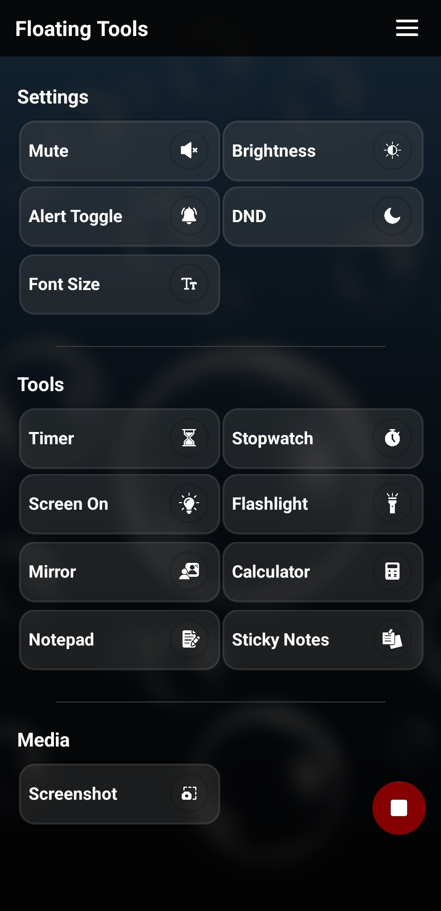
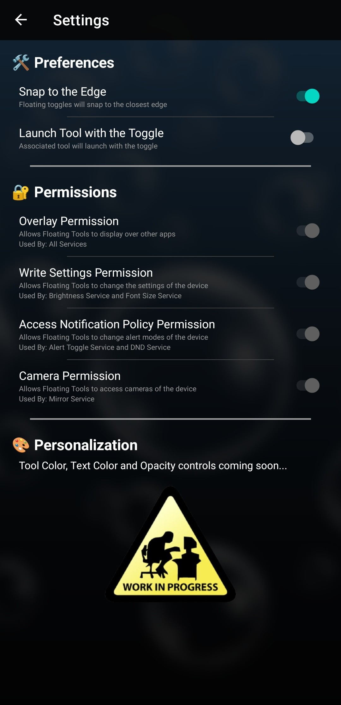
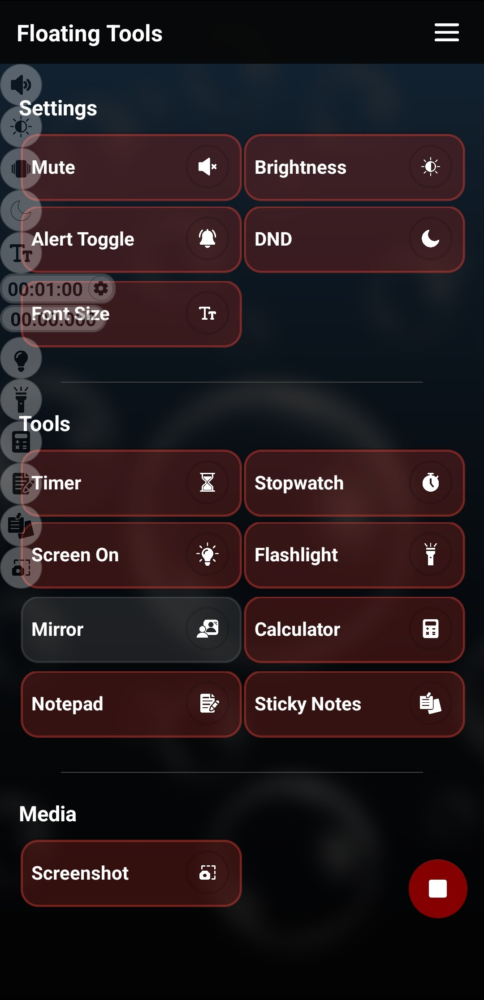
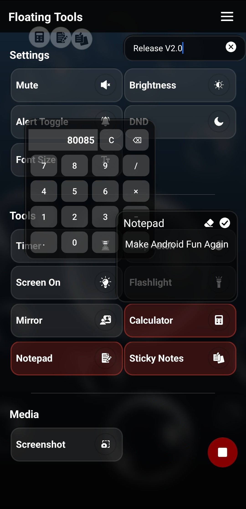

# Floating Tools App

Floating Tools is a utility app that provides quick-access floating
toggles for essential tools such as Calculator, Notepad, Screenshot,
Mirror, and more. These tools appear as movable bubbles on your screen,
allowing you to use them from any app without interruption.

## Screenshots
    

## Features

-   Floating toggles for various tools
-   Drag-and-move functionality
-   Easy one-tap activation
-   Persistent state for Notepad and Calculator
-   Quick permissions overview
-   Stop individual tools or shut down all toggles at once

## How It Works

Enable a tool from the main screen to activate its floating toggle. The
toggle stays visible across all apps and can be moved anywhere on the
screen. Tap the toggle to use the tool instantly. Drag it to the bottom
edge or press the Stop button in the app to disable tools.

## Permissions

The app requires certain permissions depending on the tool: 
- Overlay Permission
- Write Settings
- Do Not Disturb
- Camera
- Media Projection (for Screenshot)

## About

Floating Tools is designed to make multitasking easier by giving you
fast access to essential functions anytime, anywhere. The app began as 
a single function app for a mute button that could be accessed anywhere 
on the device to mute the system volume during loud annoying ads with a 
single tap. Eventually, other functions were added to make it a useful 
productivity and fun app.

## Upcoming Features

- Screen recording toggle
- Settings to customize colors and looks of the tools
- Diary option which will gather and save your notes at the end of the day
- Floating Dock to aggregate the tools for easier access
